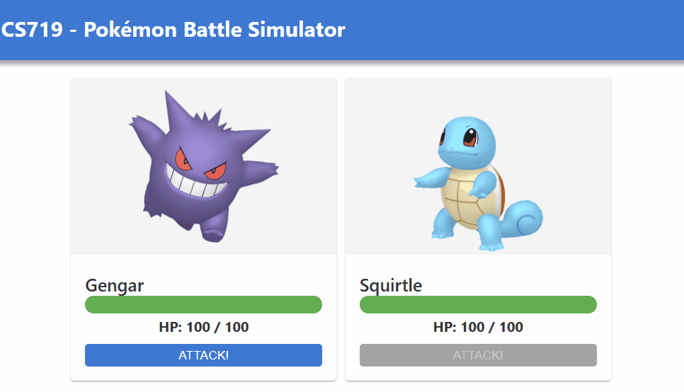
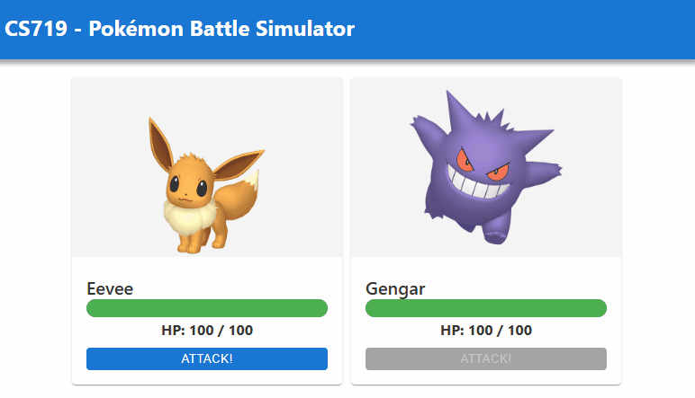
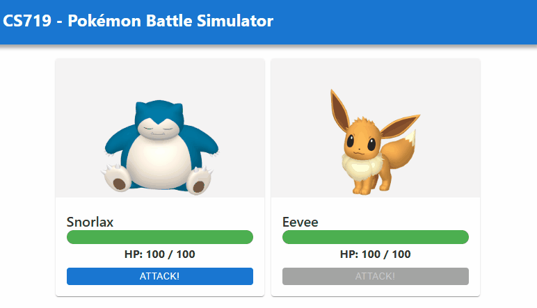

# COMPSCI 719 Assignment - A Pokémon Battle Simulator

In this assignment, you will build a simple Svelte application designed to simulate a battle between two random Pokémon. The end product will look somthing like this (depending on your own personal CSS styles):

_Example of a completed assignment._

 

The assignment will assess your knowledge of the following concepts:

1. Git / GitHub
2. HTML
3. CSS
4. Client-side JavaScript
5. Svelte components and props
6. Svelte component styling
7. Svelte stores

It will also give you the opportunity to research and apply additional techniques related to animation, such as CSS `@keyframes`, positioning, and JavaScript timers (i.e. `setTimeout()`).

A very limited amount of source code has been provided to you as a starting point. We highly suggest that you do the following as soon as you clone this repo onto your machine:

1. Read this README!
2. Install dependencies
3. Run the existing app
4. Examine the existing codebase to gain an understanding.

Once you're ready, dive into the steps below. This assignment is marked out of **100** marks. The marks for each step are given below.

## Step 0 - Git

As part of this assignment, it is expected that you make proper use of git and git commits. You are expected to make **at least one git commit for each of the steps below**. In each of the steps, there is a space for you to write the git _commit message_ corresponding to the completion of that step, so the markers can easily verify that you have done this (though you are more than welcome - and highly encouraged - to make more git commits than this, if you wish). Git commit messages should be _informative_ - they should clearly explain what the commit is about.

**Failure to make a git commit for a given step will result in a 50% penalty for the marks for that step. There will be no exceptions to this rule.**

## Step 1 - Basic layout and styling _(30 marks for code, 5 marks for written section - 35 marks total)_

For the first step, build up your user interface using Svelte components which you create. The UI should show two Pokémon, along with their HP, and each should have an "Attack" button.

For the CSS, you may use any combination of _global_ and / or _local_ styles that you wish.

The exact styling and layout you use is entirely up to you, as long as it meets the following requirements:

1. A page header should be displayed containing the text "CS719 - Pokémon Battle Simulator". It should stand out from the background in some way.

2. `$battleStore`, imported into `+page.svelte`, contains an array of Pokémon. Each Pokémon has a `dexNumber`, `name`, `hp`, `maxHp`, `imageUrl`, and `canAttack` status (true or false). Your app should loop through and display each of these Pokémon, using the `dexNumber` as a [key](https://learn.svelte.dev/tutorial/keyed-each-blocks).

3. You _must_ create a Svelte component to display a Pokémon (for example, you could callit `PokemonCard.svelte`). Your loop in _2._ above would display one of these components for each Pokémon.

   You _may_ create additional Svelte components to further decompose the UI (for example you might create a component for the header mentioned in _1._ above, and you might create another component to properly display a Pokémon's HP, as mentioned in _6._ below), but the only _required_ extra component is the one to display a Pokémon.

4. For each Pokémon, its `name`, current `hp`, `maxHp`, and image should be displayed. An "Attack" button should also be displayed for each Pokémon.

5. The Pokémon should be displayed side-by-side on larger screens, or vertically on screens smaller than `600px` in width.

6. An HP bar should be displayed to visualize a Pokémon's HP, as a proportion of its max HP. For now, you can assume a Pokémon always has full HP - updating the HP bar will be in a different step.

7. Apply CSS to the button to make a custom button, which looks different depending on whether it is "normal", `:disabled`, `:focus`, or `:active` (clicked).

8. The button should be `disabled` if the corresponding Pokémon has its `canAttack` property set to `false`.

9. Apply CSS to each Pokémon's display area to make it stand out from the background.

An example of what this might look like is shown here (but the exact styling and color scheme are up to you as long as it meets the requirements above):

_Pokémon battle sim, on a desktop browser_

_Pokémon battle sim, on a mobile browser_

**Note:** Do **not** just put all your HTML & CSS into `+page.svelte`! Consider how you might decompose into one or more svelte components. As mentioned above, you should _at least_ be creating a Svelte component to display a Pokémon and its associated info, but you are encouraged to create additional Svelte components too.

### Written section: Svelte components

In this section, write down how you have broken up your UI into different Svelte components, and why you chose that particular decomposition.

I have divided my UI into three main components: the Header component, the Card component, and the Main component. I considered moving the display of both cards into a new component, but in this instance, it didn’t make much sense aside from potentially making the structure slightly cleaner.
Design-wise, I explored a few different approaches. Initially, I planned to create a standard card component. I typically start with a color palette and build the design from there, but I struggled to find anything I liked using the usual card component layout. Eventually, I decided to blend the card into the background, which I think makes it stand out in a more subtle yet effective way.

EDIT:: i went back and did the back card layout, i figured it was more important to show and understanding of CSS concepts as opposed to looking good. 

### Git commit message

Once you've completed Step 1, remember to make a git commit! Write down the git commit message you've used to represent the final commit of step 1:

Step one complete!! added header and card components, and also added basic CSS styling. Succesfully passed the data from the Pokedex -> battle-store -> +page -> PokemonCard. 

## Step 2: Game logic _(30 marks total, see mark breakdown below)_

In this step, you will complete the game logic. This will occur mainly within the file [`battle-store.js`](./src/lib/js/battle-store.js), but will also require you to handle when the user clicks on your "Attack" buttons you created in Step 1.

Currently, this file contains a writable Svelte store called `battleStore`, which we export (and you probably used, using `$battleStore` in the previous step). This store is initialized with an array of two Pokémon, from the `getTwoRandomPokemon()` function. The file also exports a function called `attack()`, which currently does nothing other than `return` early if the `attacker` isn't able to attack.

### Call the `attack()` function appropriately _(10 marks)_

Whenever the user clicks one of your "Attack" buttons, this should result in the `attack()` function being called, with the `attacker` arg set to the Pokémon whose "Attack" button was clicked, and its `defender` arg set to the other Pokémon. There are many ways to achieve this; we recommend something similar to the following:

1. Add a [custom event](https://learn.svelte.dev/tutorial/component-events) to your Pokémon display Svelte component. When its "Attack" button is clicked, raise that event.

2. Handle this event from `+page.svelte`. The custom event's `detail` prop will contain info about the attacking Pokémon, while the defending Pokémon can be obtained using the JavaScript array `find()` function (i.e. "Find me a Pokémon in this array whose `dexNumber` is not equal to the attacking Pokémon's `dexNumber`").

3. Import the `attack` function from `battle-store.js` into `+page.svelte` so you can call it there. Call it from your event handling code above, passing in the `attacker` and `defender` appropriately.

4. Within the `attack()` function, log the `attacker` and `defender` to the console, for testing purposes.

### Implement the battle logic _(15 marks)_

The battle logic in the `attack()` function should be implemented as follows. Implement this functionality at the marked location in `battle-store.js`. You can also write additional functions and call them from within the `attack()` function, to better decompose your code and make good use of functions:

1. **Calculate max damage to inflict:** This should be a random integer between 10 and 20.

2. **Apply critical hit:** With a _10% chance_, the damage should be a _critical hit_. in this case, the max damage should be set to **40**.

3. **Calculate actual damage to inflict:** The actual damage should be either the defending Pokémon's remaining `hp` or the previously calculated max damage, whichever is lower.

4. **Apply damage:** Subtract the damage from the defending Pokémon's `hp`.

5. **Switch turns:** The attacker's `canAttack` status should be set to `false`. The defender's `canAttack` status should be set to `true`, but only if its `hp` is greater than 0.

**Hints:**

- A function called `updateBattleStore()` is written for you and is currently being called at the end of the `attack()` function. Keep it there to ensure that the Svelte store gets updated properly with any changed data based on the attack calculations.

- Feel free to write one or more JavaScript functions to help you with this step - you don't need to put all the code into the `attack()` function. It could be nicer to break up the code into multiple functions - for example, one for calculating damage, another for applying damage, another for switching turns.

Once you've completed this step, your app should function similarly to the gif below:

_Example showing the UI successfully updating when an "Attack" button is clicked._

### Git commit message

Once you've completed Step 2, remember to make a git commit! Write down the git commit message you've used to represent the final commit of step 2:

 "added functionality to the attack button, added a custom event to allow communication between components, added the game login to battle store"

## Step 3: Functional HP bar _(15 marks)_

For this step, modify your HP bar so that it properly displays the proportion of remaining HP. In addition, the color of the HP bar, and the HP text, should change if the Pokémon's HP is below 20%.

After completing this step, your app should function similarly to the gif below:

_Example showing the HP bar changing, and a color change when below 20% HP._

### Git commit message

Once you've completed Step 3, remember to make a git commit! Write down the git commit message you've used to represent the final commit of step 3:

Added HP bar logic based on percentage, changed HP bar fill and text color when HP is below 20%

## Step 4: Fancy battle animations! _(15 marks for animations, 5 marks for written section - 20 marks total)_

For the final step, add some animations to a Pokémon whenever they take damage. In addition, display a visual indicator on a Pokémon whenever they "win" the battle - that is, whenever their opponent's HP drops to 0.

**Note:** This step is considered a _challenge_ step, and may require you to research further CSS, JavaScript and Svelte techniques not explicitly taught in the course.

An example of the kinds of animations and victory indicator you could add can be seen in the gif below:

_Example of a completed assignment._

In the example gif, we can see that, when a Pokémon is attacked, their HP bar drops smoothly, rather than instantly. In addition, an outline appears around the HP bar while their HP is dropping. Finally, the amount of damage inflicted appears on the right-hand side of the HP bar, and gradually floats up (with the words "Critical Hit!" appearing instead, if it was a critical hit).

In addition to the damage animation, we can see that an image of a crown appears next to the winning Pokémon.

To achieve these effects, the model solution uses a combination of the following:

1. [CSS transitions](https://developer.mozilla.org/en-US/docs/Web/CSS/CSS_transitions/Using_CSS_transitions)
2. [CSS positioning](https://developer.mozilla.org/en-US/docs/Web/CSS/position)
3. [CSS animations (`@keyframes`)](https://developer.mozilla.org/en-US/docs/Web/CSS/CSS_animations/Using_CSS_animations)
4. [JavaScript timers (`setTimeout()`)](https://developer.mozilla.org/en-US/docs/Web/API/setTimeout)
5. One extra Svelte store to store information about which Pokémon most recently took damage, how much damage, and whether it was a critical hit.

Your animation - or combination of animations - must use **at least three** of the above techniques (but may also use other techniques not mentioned here if you wish).

**Remember:** You _don't_ have to try and implement exactly the same animation as shown here - use your imagination 😊 - A solution exactly the same as the example will receive good marks, but so will something completely different, but similarly complex.

### Written section: Design decisions

In the space below, write an explanation detailing _what_ animations you implemented in this step, _how_ you achieved those animations, and _why_ you chose to do it that way.

I added several animations to enhance the pokemon battle interactions. I implemented a victory crown that appears next to the winning pokemon and used a keyframes animation to make it "blink." I also applied the same keyframe animation to the HP bar, as well as the max HP and HP data. To achieve the blinking effect, I set different stages of opacity, then used the transform property to control the timing and number of repetitions.

A similar approach was used for the losing pokemon, where its card scales down in size, while its opacity also darkens, this contrasts with the winner's card that instead a brighter box-shadow animation, creating a sense of triumph.

During the game stage and when a pokemon attacks another pokemon, I applied a keyframe animation to rotate the image while simultaneously adding a border radius. I also attempted to mimicked the hp border effect used in the example, my variation was done by also using keyframes. 

For both the victory crown and the damage indicators, I alos used CSS positioning. This was implemented by setting the parent's position to relative and the child's to absolute, this allowed for the manual position of elements vis top and right positioning properties.

To manage the conditional CSS for these animations, I created a Svelte store called damageStore. The state of this data is updated within the attack function and imported into the +page component, where it is subscribed to. The state is then passed into the card component as props, where the CSS is conditionally rendered, and the win or loss logic is shown in the UI.

I used multiple methods to render CSS. I conditionally passed props based on ternary operators, applied CSS classes conditionally, and also utilized conditional rendering of HTML elements using if-else statements.

In terms of the 'why', I used a combination of trying to mimic the animations from the examples, implementing things I have seen or used before, and working within the color palette limitations I initially set up.

### Git commit message

Once you've completed Step 3, remember to make a git commit! Write down the git commit message you've used to represent the final commit of step 3:

completed step 4, passed data from damage store to the pokemon card component and subscribed to any updates to the store, added advanced CSS animations and conditionally rendered data based on state, moved locally hosted images back to the original github url, completed final written section also. 

## Final Step: GenAI Usage

There's no mode coding for the assignment - you're done 🥳 However, please write below:

1. Did you use generative AI (e.g. ChatGPT, GitHub Copilot, etc) during this assignment? Answering _Yes_ or _No_ will **not** negatively affect your grade for this assignment in any way, so _please be honest_. 

2. If you did, how did it _help_ you? 

3. If you did, did you encounter any _problems_ when using it? Was anything more _difficult_ than expected?

### Your answer

1. Yes 

2. It helped to point out errors, such as referencing a function versus calling the function. It also helped me to understand concepts a lot more thoroughly. For example, I could ask about the difference between infinite and forwards in a CSS transform. I find a lot of online documentation resources to be somewhat obscure and verbose, and AI helps a lot with clarifying the questions that i may have. Its essentially like Stack Overflow but supercharged. 

3. YESS!!! It hallucinates all the time and misses a lot of data. It's definitely a companion rather than an autonomous entity. I can be super helpful but also super frustrating at the same time. 
# pokemon
